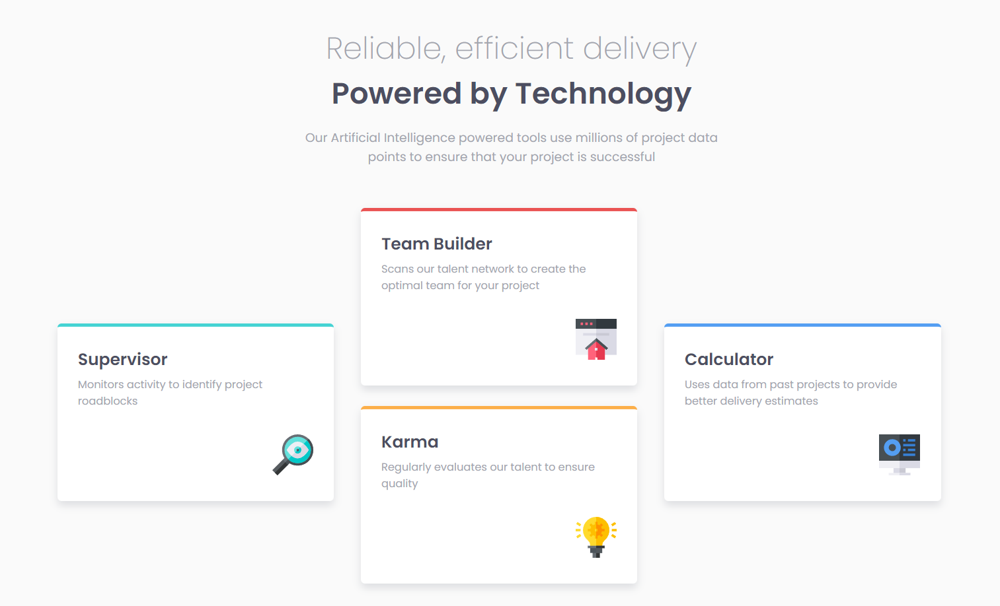

# Frontend Mentor - Four card feature section solution

This is a solution to the [Four card feature section challenge on Frontend Mentor](https://www.frontendmentor.io/challenges/four-card-feature-section-weK1eFYK). Frontend Mentor challenges help you improve your coding skills by building realistic projects. 

## Table of contents

- [Overview](#overview)
  - [The challenge](#the-challenge)
  - [Screenshot](#screenshot)
  - [Links](#links)
- [My process](#my-process)
  - [Built with](#built-with)
  - [What I learned](#what-i-learned)
  - [Continued development](#continued-development)
  - [Useful resources](#useful-resources)
- [Author](#author)

## Overview

### The challenge

Users should be able to:

- View the optimal layout for the site depending on their device's screen size

### Screenshot

### Links

- Solution URL: [Link](https://github.com/codebyveronica/four-card-feature)
- Live Site URL: [Link](https://codebyveronica.github.io/four-card-feature/)

## My process

### Built with

- Semantic HTML5 markup
- CSS custom properties
- Mobile-first workflow
- Media Query
- Multi-columns

### What I learned

I learned to use multi-columns. I didn't know this property existed and it was fun to learn how to use it. I believe that CSS Grid is probably a better application than what I did, but it is a way to learn Grid in the future.

### Continued development

Now that I understand better how columns work, I believe it's a good time to start learning Grid too.

### Useful resources

- [MDN Web Docs](https://developer.mozilla.org/en-US/) - This helped me a lot in researching CSS properties including multiple columns

## Author

- Frontend Mentor - [@codebyveronica](https://www.frontendmentor.io/profile/codebyveronica)
